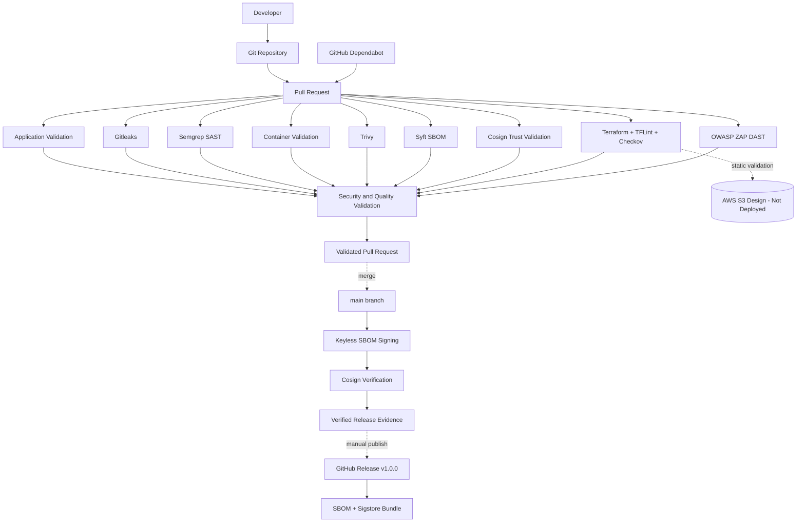

# DevSecOps Secure Software Delivery Platform

**Core technologies:** Node.js · Docker · GitHub Actions · Gitleaks · Semgrep ·
Trivy · Syft · Cosign · Sigstore · Terraform · TFLint · Checkov · OWASP ZAP

A greenfield portfolio implementation of a secure software delivery platform
focused on integrating security controls throughout the software delivery
lifecycle.

The project demonstrates practical DevSecOps engineering across application
validation, source-code security, container security, software supply-chain
security, Infrastructure as Code validation, Dynamic Application Security
Testing, and dependency maintenance.

## Project Status

**v1.0.0 — Initial Portfolio Release**

The DevSecOps Secure Software Delivery Platform is complete within its defined
portfolio scope.

The project includes:

- automated application testing and coverage enforcement
- dependency vulnerability auditing
- secret scanning
- Static Application Security Testing
- hardened container validation
- container vulnerability scanning
- Software Bill of Materials generation
- keyless SBOM signing and identity verification
- Infrastructure as Code security validation
- Dynamic Application Security Testing
- automated dependency maintenance
- threat modeling
- security control traceability
- documented architecture decisions

## Architecture

The Terraform infrastructure is statically validated but is not automatically
deployed by the repository.

## DevSecOps Pipeline

Every pull request to `main` is evaluated by the project's automated security
and quality controls.

| Area | Control | Technology |
|---|---|---|
| Application | Tests and coverage | Node.js test runner |
| Dependencies | Vulnerability audit | npm audit |
| Secrets | Secret scanning | Gitleaks |
| Source code | SAST | Semgrep |
| Container | Runtime hardening validation | Docker |
| Container | Vulnerability scanning | Trivy |
| Supply chain | SBOM generation | Syft / SPDX |
| Supply chain | Artifact trust | Cosign / Sigstore |
| Infrastructure | IaC validation | Terraform |
| Infrastructure | IaC linting | TFLint |
| Infrastructure | Misconfiguration scanning | Checkov |
| Runtime | DAST | OWASP ZAP |
| Dependencies | Continuous maintenance | GitHub Dependabot |

## Security Gates

The project currently uses nine automated workflow areas:

1. Application validation
2. Secret scanning
3. Static Application Security Testing
4. Secure container validation
5. Container vulnerability scanning
6. Software Bill of Materials generation
7. Artifact trust validation and keyless SBOM signing
8. Infrastructure as Code security validation
9. Dynamic Application Security Testing

Keyless SBOM signing is intentionally restricted to trusted `main` executions.

Pull request artifacts are not signed using the trusted main-branch workflow
identity.

## Application

The repository contains a minimal Express application used as the target for
the secure delivery platform.

Endpoints:

- `GET /health`
- `GET /version`
- `GET /api/status`

The application intentionally remains small so the project can focus on the
security and delivery architecture rather than application feature complexity.

Application controls include:

- request body size limits
- disabled `X-Powered-By` disclosure
- `X-Content-Type-Options: nosniff`
- `Cross-Origin-Resource-Policy: same-origin`
- automated API tests
- smoke testing

## Container Security

The application runtime image uses a multi-stage Docker build.

Runtime controls include:

- pinned Node.js base image digest
- non-root application user
- production-only dependencies
- package-management tooling removed from the runtime image
- read-only filesystem validation
- temporary writable storage only where required
- all Linux capabilities dropped
- `no-new-privileges`
- application health checks
- graceful process termination

The application image is scanned with Trivy.

The current project does **not** claim that the container image itself is
cryptographically signed.

## Software Supply Chain

### SBOM

Syft generates an SPDX 2.3 JSON Software Bill of Materials from the built
container artifact.

The SBOM generation process validates:

- JSON structure
- SPDX version
- package inventory
- relationships
- application package presence
- Express dependency presence

### Keyless Signing

Cosign and Sigstore are used to sign the generated SBOM on trusted `main`
executions.

The signing design:

- uses GitHub Actions OIDC
- requires no long-lived signing private key
- verifies the exact workflow identity
- verifies the GitHub OIDC issuer
- produces a Sigstore bundle
- uses a digest-pinned Cosign image

## Dynamic Application Security Testing

OWASP ZAP performs API-focused DAST against the running application.

The DAST process:

1. builds the application container
2. creates an isolated internal Docker network
3. starts the target using hardened runtime controls
4. waits for application health
5. imports the OpenAPI specification
6. performs active and passive security testing
7. fails when the configured policy reports warnings or failures
8. generates HTML, JSON, Markdown, and log evidence

An initial scan identified missing security response headers.

Those findings were remediated in the application and protected with automated
tests.

The validated scan subsequently completed with zero warnings and zero failures.

## Infrastructure as Code

Terraform describes a deliberately small AWS evidence-storage design.

The configuration contains:

- private S3 bucket
- S3 Block Public Access
- BucketOwnerEnforced ownership
- versioning
- SSE-S3 encryption
- lifecycle controls

Validation includes:

- `terraform fmt`
- `terraform validate`
- TFLint
- Checkov

The project intentionally does not automatically execute `terraform apply`.

This avoids requiring persistent AWS credentials in the CI pipeline and keeps
the portfolio project focused on DevSecOps controls rather than cloud resource
operation.

## Dependency Security

GitHub Dependabot monitors:

- npm
- Docker
- GitHub Actions
- Terraform

Dependabot vulnerability alerts and security updates are enabled.

Automatic merge is intentionally disabled.

Dependency update proposals remain subject to the same DevSecOps validation
pipeline as other changes.

## CI Pipeline Security

GitHub Actions workflows follow several supply-chain controls:

- external Actions pinned by commit SHA
- security container images pinned by SHA-256 digest
- `persist-credentials: false` on repository checkout
- read-only repository permissions by default
- OIDC permission limited to the signing job
- no `pull_request_target`
- no persistent AWS credentials
- no privileged scanner containers
- no Docker socket mounting

## Security Architecture

Detailed security documentation is available in:

- [Threat Model](docs/security/threat-model.md)
- [Security Controls Matrix](docs/security/security-controls-matrix.md)
- [Final Security Review](docs/security/final-security-review.md)
- [OpenAPI Specification](docs/security/openapi.yaml)

## Architecture Decision Records

Engineering and security decisions are documented under `docs/adr/`.

The ADR set covers:

1. application and testing foundation
2. CI security baseline
3. secret scanning
4. Static Application Security Testing
5. secure container runtime
6. container vulnerability scanning
7. Software Bill of Materials
8. keyless artifact signing
9. Infrastructure as Code security validation
10. Dynamic Application Security Testing
11. dependency security automation

## Repository Structure

    .
    ├── .github/
    │   ├── dependabot.yml
    │   └── workflows/
    ├── docs/
    │   ├── adr/
    │   └── security/
    ├── scripts/
    ├── src/
    ├── terraform/
    ├── tests/
    ├── Dockerfile
    ├── SECURITY.md
    ├── THIRD_PARTY_NOTICES.md
    ├── package.json
    └── README.md

## Local Validation

Application validation:

    npm ci --ignore-scripts
    npm run verify

Container security:

    bash scripts/container-test.sh
    bash scripts/trivy-scan.sh

Generate and validate the SBOM:

    bash scripts/generate-sbom.sh

Infrastructure as Code validation:

    bash scripts/iac-validate.sh

Dynamic Application Security Testing:

    bash scripts/dast-scan.sh

The keyless SBOM signing script requires the GitHub Actions OIDC environment and
is intentionally expected to reject local execution without that identity.

## Security Documentation Philosophy

Scanner findings are not blindly suppressed.

Security findings are handled as one of:

- remediate
- explicitly justify
- identify as not applicable

Examples of documented scope decisions include:

- SSE-S3 instead of customer-managed KMS for the minimal evidence bucket
- no cross-region replication
- no dedicated S3 access logging
- no S3 event notifications
- no production cloud deployment
- no container image signing until a registry-backed release model exists

## Scope

This is a portfolio and demonstration project.

It is not presented as a production service.

The project does not claim:

- production deployment
- production authentication or authorization
- production-grade high availability
- automatic infrastructure deployment
- container image signing
- CodeQL scanning

Synthetic and demonstration data are used.

No employer source code, credentials, architecture, proprietary configuration,
or internal operational information is included.

## Engineering Principles

- security controls should be automated where practical
- least privilege should be the default
- immutable dependency references are preferred
- build and security evidence should be reproducible
- security exceptions must be visible and justified
- proposed dependency updates must pass the same security gates as source changes
- CI should avoid long-lived credentials
- implementation claims must match controls that actually exist

## License and Third-Party Software

Repository-specific material is provided under the terms in [LICENSE](LICENSE).

Third-party software and services remain subject to their respective licenses
and ownership.

See [THIRD_PARTY_NOTICES.md](THIRD_PARTY_NOTICES.md).

## Release

**Current release: [v1.0.0](https://github.com/Jes-lo/devsecops-secure-delivery-platform/releases/tag/v1.0.0)**

The initial portfolio release includes the generated SPDX Software Bill of
Materials and its Sigstore verification bundle as release artifacts.

The release corresponds to the implementation that completed the project's
defined DevSecOps portfolio scope.
